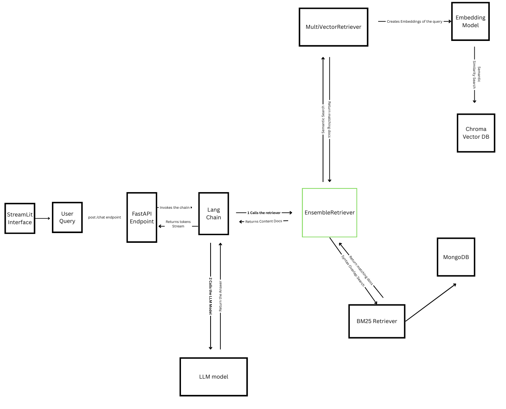
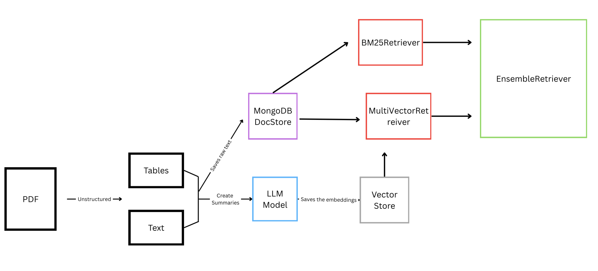

# FoxBase Data Scientist - Task


This project implements a Retrieval-Augmented Generation (RAG) system for FoxBase Task, using LangChain and LangFuse. The system performs document parsing and evaluates the RAG-based models for tasks such as question answering from the parsed technical manual document.

## Installation

To install the required dependencies, run:

```bash
pip install -r requirements.txt
```

## Usage

### Running using Docker-Compose

To start the system, execute the following command:

```bash
docker-compose up --build
```

### Document Parsing

To trigger the document parsing pipeline, use the following command:

```bash
python document_pipeline_trigger.py
```

### LangFuse Evaluation

To trigger the RAG evaluation with LangFuse, run:

```bash
python ragas_evaluation.py
```

## Configuration

Create a `.env` file in the root directory with the following configurations:

```env
# API KEYS
GROQ_API_KEY="your-groq-api-key"
OPENAI_API_KEY="your-openai-api-key"

# FILE PATHS
PDF_FILE_PATH="./doc_data/technical_manual.pdf"
CHROMA_DB_PATH="./doc_data/chroma_db"
EVALUATION_DB_PATH="./evaluation_dataset/questions_answers.csv"
BM25_SAVE_PATH="./doc_data/bm25_documents.txt"

# MONGODB CONFIG
MONGODB_URL="mongodb://localhost:27017/"
MONGODB_NAME="test-db"
MONGODB_COLLECTION_NAME="foxbase-collection-6"

BACKEND_URL = "http://foxbase_backend:8000/chat"

HUGGING_FACE_API_KEY="your_hugging_face_key"

# COLLECTION NAME
COLLECTION_NAME="foxbase_collection_6"

# LANGFUSE KEYS
LANGFUSE_PUBLIC_KEY="your-langfuse-public-key"
LANGFUSE_SECRET_KEY="your-langfuse-secret-key"
```

Make sure to replace placeholders (`your-groq-api-key`, `your-openai-api-key`, etc.) with actual values.

## System Flow

### Overview of the System Inference Flow
This RAG system integrates multiple retrieval methods to enhance response accuracy. The process begins with a Streamlit interface, where users submit queries, which are then sent to a FastAPI endpoint via a /chat POST request.

The FastAPI server invokes a LangChain pipeline, which orchestrates the retrieval and response generation. The retrieval process is managed by an EnsembleRetriever, which calls two different retrievers: MultiVectorRetriever and BM25Retriever.

The MultiVectorRetriever leverages an embedding model to generate vector embeddings of the query and searches for relevant content in the Chroma Vector DB.

Meanwhile, the BM25Retriever fetches relevant documents from MongoDB using traditional keyword-based search.
The retrieved documents are then combined and returned to LangChain, which forwards them to the LLM model for response generation. The LLM processes the input and returns a response stream back to the user via FastAPI and Streamlit.

This hybrid retrieval strategy ensures both semantic and keyword-based search effectiveness, improving the quality of responses.



## Document Processing Pipeline 

The PDF gets passed to Unstructured library to extract Text and Table Elements, then creating a summarization using
LLM, and embedding it to the Chroma DB Vector Store. While keeping the raw data in the MongoDB Doc Store. The
MultiVectorRetriever uses the docstore and vectorstore for retrieval. Moreover, the BM25 Retriever (keyword
matching) gets initialized with the documents from the docstore. And passing both to the EnsembleRetriever for the
hybrid search



## System Components Overview

This Retrieval-Augmented Generation (RAG) pipeline is designed for processing Technical Manual PDFs with high precision, extracting both structured and unstructured content, and enabling hybrid retrieval (semantic + lexical). The pipeline leverages:

- **LLaMA 3.1 8B (Open Source LLM)** for summarization and response generation.
- **Multilingual MiniLM-L12-v2 (Open Source Embedding Model)** for dense vector embedding.
- **Unstructured Library Integration** for high-resolution PDF parsing.
- **MongoDB Docstore** (raw texts/tables) + **ChromaDB Vectorstore** (summarized texts and tables) for flexible retrieval.
- **Hybrid Ensemble Retriever** combining BM25 and semantic retrieval.
- **FastAPI** for the REST API endpoint, supporting streaming and asynchronous processing.
- **Streamlit Interface** for easy interaction with the system.


## Evaluation

The RAG system was evaluated using RAGAS and LangFuse. RAGAS assesses the ability of the model to retrieve relevant information and generate accurate, context-aware responses. LangFuse helps monitor and improve model performance in production.

### Evaluation Metrics:
1. **Semantic Similarity (0.7679)** - Strong similarity with room for improvement in precision.
2. **Answer Relevancy (0.6341)** - Moderate relevance; needs improvement in user intent alignment.
3. **Faithfulness (0.8218)** - High accuracy in staying true to the retrieved context.
4. **LLM Context Precision Without Reference (0.7881)** - Strong precision in integrating relevant details.
5. **Answer Accuracy (0.6559)** - Indicates moderate agreement with reference ground truth.

These results demonstrate solid performance, with opportunities for fine-tuning in relevance and answer precision.
